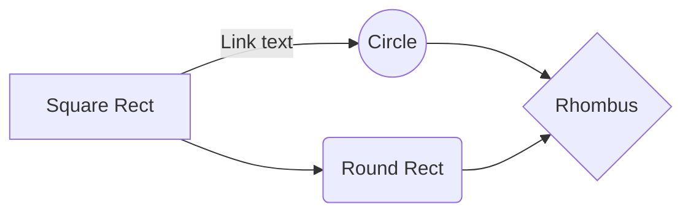

---

date:

created: 2025-04-01

updated: 2025-05-02

authors:

- p_hieu

categories:

- Tổng quan

tags:

- Mới bắt đầu

- Ros2

- Robotics

- Giới thiệu

pin: true

draft: false

links:

- Homepage: index.md

- Blog index: blog/index.md

- External links:

- Material documentation: https://virobo.org/training

---

# Sứ mệnh và mục tiêu

  

## Sứ mệnh

  

- Tại sao cần học phát triển Robotic

Nền kinh tế Robot cần những nhà phát triển nó!

  

Tôi muốn kể với bạn một câu chuyện liên quan đến bản thân để bạn hình dung ra vì sao cá nhân tôi lại tìm hiểu lĩnh vực này. Lúc tôi mới làm việc trong lĩnh vực phần mềm năm 2017, tôi đã thấy nhiều công ty outsource lập trình web/game có quy mô lớn. Và như bao nhiêu người khác, tôi cần một công việc phổ biết lúc đó để nuôi sống bản thân. Tôi học lập trình c# rồi java, sql, sau đó muốn trở thành fullstack developer thì lại học thêm html,css, js. Trong những năm rất ngắn, tôi lại phải học thêm angular js, angular 2+, reactjs, vuejs, nextjs .... Sau đó tôi lại phải học thêm cloud aws, azure rồi CI/CD, docker, terraform,  ... rồi các thuật toán Machine learning, AI Engineer. Không hẳn là bạn cần phải học quá nhiều mà các dự án outsource luôn yêu cầu bạn bổ sung những tập kỹ năng mới. Mặc dù nhiều chứng chỉ nhưng thực sự là nó không hiếm!

  

Tôi tự đặt câu hỏi, tại sao lúc nào cũng bị thị trường lao động kéo mình đi và mình đang **chủ động học một cách bị động!** . Tức là trông thì giống như mình đang tự học kiến thức mới, nhưng thực ra nó là nhu cầu của thị trường lúc đó đã có, khách hàng cũng đã biết đến những công nghệ như vậy nên để tăng lương/kiếm cơm thì mình cũng đành phải tìm hiểu. Nhưng thực tế là, đến lúc mà những công nghệ đó thực sự phổ biến và thu hút, thực sự kỹ năng của bạn cũng không hề hiếm, giá trị của bạn cũng không quá cao nữa.

  

Như các bạn biết đấy, tư duy làm chủ và tư duy làm thuê nó đã khác nhau ở đây. Tại sao các vị CEO, chủ tập đoàn lớn họ luôn đặt ra phương hướng, mục tiêu cho từ ít nhất 3-5 năm hoặc hơn. Dĩ nhiên là cách hành động trong 3-5 năm đó không cố định (Tầm nhìn sẽ giữ nguyên, hành động sẽ phải thay đổi tùy thị trường/bối cảnh cụ thể). Áp dụng phương pháp đó, thử lên chiến lược cho sự nghiệp bản thân mình xem thử, 3-5 năm sau mình thị trường sẽ phổ biến công nghệ/kỹ thuật gì để bản thân có thể chiếm lợi thế (đủ lớn) so với những người khác?

  

Hành trình tiếp tục với những startup tôi đã tham gia mang lại tôi những kinh nghiệm (mang tính chủ quan): 2020-2021 startup blockchain game-fi khi thấy thành công của Axie Infinity, 2023-2024 startup Generative AI khi ChatGPT đã ra mắt. Co-founder cùng tôi có những anh đã từng làm Google Search, có những anh làm manager/director và những người có tiềm lực tài chính ổn. Thật ngạc nhiên, chúng tôi liên tục thất bại vì lý do thị trường downtrend ngay trước khi chúng tôi kịp đưa ra sản phẩm!

Bạn biết đấy, tôi tự thấy mình không kiên trì lắm, nhưng tôi nghĩ nếu cố đi đâm đầu vào tường cũng không phải là 1 cách khôn ngoan. Một là cũng rất nhiều người đập đầu vào đó, nhưng đầu bạn cứng nhất, hoặc là bạn bị thương mà bức tường thực sự không phải cánh cửa. Năm 2023, Tôi cũng đã có cơ hội tiếp xúc với một số founder của các công ty đang thành công ở Việt Nam về AI, thật bất ngờ là họ đều đã thành lập từ những năm 2017-2018 .

Hơi lan man phải không, được rồi tôi sẽ quay lại tại sao phải học robot? Bạn hãy tự trả lời 3-5 năm nữa nhu cầu phát triển robot hoặc độ phổ biến của nó sẽ như thế nào?

Tôi khá chắc chắn về tương lai gần của nó, thực sự là vì tôi đã cược nó tới 80% sẽ xãy ra. Bạn đừng lo về thị trường sẽ bị chiếm lĩnh bởi những công ty lớn, họ phát triển và phân phối. Nhưng họ sẽ tạo ra thị trường, và chắc chắn bạn sẽ kiếm được tiền từ vô vàn thị trường ngách hoặc nội địa.Tesla hoặc Unitree khá chắc là không đi sản xuất 1 robot gội đầu tự động đâu!

  

>Với quan niệm: bạn sẽ hiểu sâu nhất khi bạn dạy lại cho ai đó, tôi cũng hy vọng rằng, những câu hỏi của các bạn, sự hệ thống hóa kiến thức thành bài giảng sẽ giúp chính tôi phát triển sâu hơn kỹ năng của mình. Vậy nên đừng ngại liên hệ hoặc đặt câu hỏi cho tôi nhé.

  

**Tóm lại với tầm nhìn đó, tôi sẽ cùng các bạn chia sẽ những kiến thức về lĩnh vực robot, giúp bạn và cả tôi nắm chắc kỹ thuật tiên tiến này để cá cược rằng tương lai sẽ thuộc về chính chúng ta.**

  

## Khó khăn và thách thức

  
Hãy biết trước những trở ngại sắp tới, để chúng ta chuẩn bị tâm thế đối mặt. Một là từ bỏ, hai là chuẩn bị trước thời gian và tinh thần để chiến đấu.

- So sánh giữa lập trình robot và lập trình web/mobile/ai

  
|     Tiêu chí   |Robot Operating System         |Web Dev (Mobile/AI)                         |
|----------------|-------------------------------|-----------------------------|
|Mức nền tảng cần có|`Cao: Cần hiểu C++, Linux, real-time, cơ điện tử, toán học robot (kinematics), Cảm biến, AI, Cân bằng`            |'Thấp đến trung bình: học dần từ cơ bản đến nâng cao'            |
|Độ phức tạp tổng thể|`"Rất cao: nhiều lớp abstraction, middleware DDS, hardware interface, topic/service..."`            |"Từ đơn giản đến vừa"            |
|Yêu cầu cấu hình hệ thống|`Cao: cần mô phỏng, Gazebo, RViz, build, compile vào chip/sensor`| browser hoặc local server|
|Lộ trình học|`Dốc đứng: khó hiểu, dễ bị choáng (đặc biệt nếu không có nền kỹ thuật robot)`            |'học mỗi công nghệ thì áp dụng hoặc test rất nhanh'  
|Ứng dụng thực tế|`Cao cấp: xe tự hành, drone, robot sản xuất, robot hình người`            |'Phổ thông: trang web, web app, hệ thống quản lý doanh nghiệp' 
|Cộng đồng – Tài liệu|`Nhỏ hơn, chuyên sâu, chủ yếu là người làm robotics hoặc nghiên cứu`            |'Rất lớn, dễ tìm tutorial, StackOverflow ' 

Với lộ trình học khá phức tạp, hãy sẵn sàng tâm lý là bạn không thể nhanh chóng nắm rõ kỹ thuật này trong vòng 1 năm mày mò liên tục như học kỹ thuật phần mềm đâu nhé. 
Theo tôi tìm hiểu trên các diễn đàn reddit, các trường đại học hàng đầu đào tạo robotic cũng chỉ kỳ vọng sinh viên làm quen với robot trong vòng 6 tháng đầu và thực sự có thể làm sample đơn giản trong vòng 6 tháng tiếp theo. Nhưng hãy yên tâm, khóa học của tôi sẽ tập trung vào thực chiến kiến thức trọng tâm và không quá thách thức sự kiên trì của bạn đâu.

## Lộ trình khóa học

Lộ trình học ROS 2 từ cơ bản đến nâng cao (cho người làm robot thị trường thật)

|                |ASCII                          |HTML                         |
|----------------|-------------------------------|-----------------------------|
|Module1: |Làm quen với ros2 và mô phỏng robot            |**Mục tiêu:** Hiểu kiến trúc ROS 2, chạy mô phỏng đơn giản.✅ Cài ROS 2 Jazzy trên Ubuntu 22.04 ✅ Học các lệnh cơ bản: `ros2 run`, `ros2 launch`, `ros2 topic`, `ros2 service`, `ros2 interface`✅ Chạy demo: `ros2_control_demos`, `turtlebot3_simulations`, hoặc `ros2_control_demo_example_7`✅ Hiểu:Nodes / Topics / Services / Actions URDF / XACRO (mô tả robot)Gazebo / RViz (mô phỏng & visualization) Launch file & YAML config            |
|Module2         |Điều khiển thực tế và ROS 2 Control            |**Mục tiêu:** Kết nối phần cứng hoặc mô phỏng với `ros2_control`✅ Hiểu khái niệm: Hardware Interface, Controller Manager ✅ Viết `hardware_interface` giả lập✅ Sửa được URDF có `transmission`, `joint_limits` ✅ Gửi trajectory qua code hoặc rqt ✅ Dùng Gazebo với plugin `ros2_control` → test            |
|Module3|Cảm biến – Phản hồi – Thông minh | **Mục tiêu:** Robot có “phản xạ” với môi trường ✅ Gắn camera, lidar (thật hoặc ảo)✅ Dùng rqt_plot, RViz để debug✅ Nhận diện vật thể với YOLOv8 + ROS 2 bridge ✅ Dùng TF2 (transform frames) để xác định vị trí tương đối|
|Module4|Tự động hóa nâng cao & AI | **Mục tiêu:** Tự hành, phản ứng thông minh, GUI điều khiển✅ Navigation2 cho di chuyển tự động✅ Action server (gửi lệnh dài hạn như “đi tới điểm X”) ✅ Tích hợp AI với Python + `rclpy`✅ Tạo giao diện web (ReactJS + ROSBridge) điều khiển robot|
|Module5|Thực chiến robot công nghiệp | **Mục tiêu:**  Phát triển cánh tay robot linh hoạt cao trong nhà máy để thực hiện: `Cầm nắm đồ vật`, `Phân loại hàng mẫu`, `Kiểm soát hàng lỗi`, `Phối hợp giữa 2 tay`|
|Module6|Thực chiến robot cao cấp | **Mục tiêu:**  Phát triển chó robot giống cyberDog của Xaomi với tiếng Việt và văn hóa bản địa.|

 
And this will produce a flow chart:

